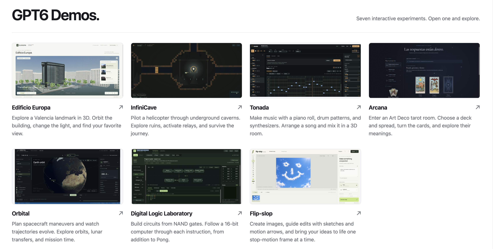
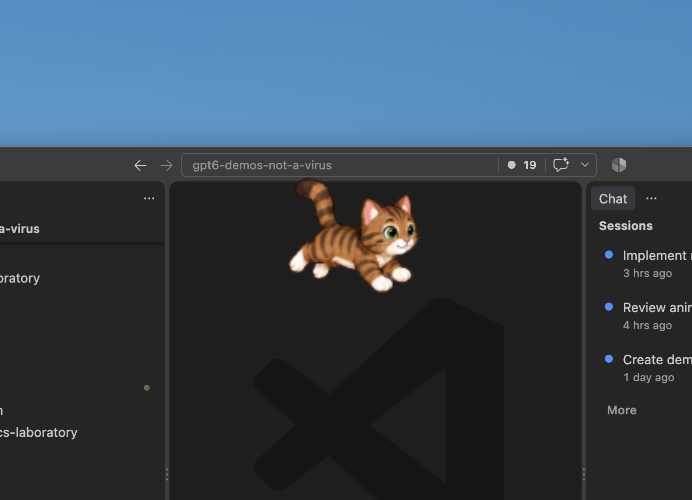
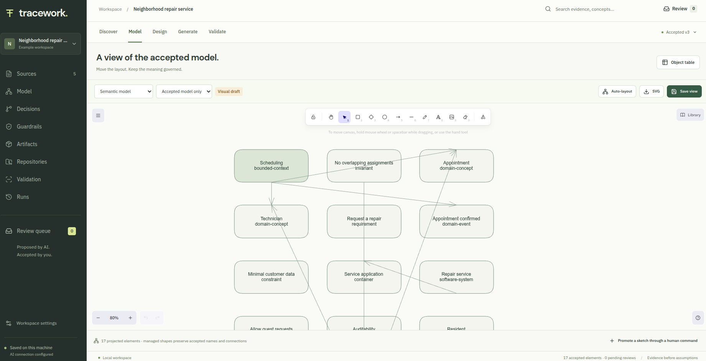

# GPT6 Demos

[](./LICENSE.md)
[](#platform-support)
[](#platform-support)
[](https://bun.sh/)
[](https://www.typescriptlang.org/)
[](https://threejs.org/)
[](#principles-of-participation)

A collection of interactive web and native desktop demos exploring 3D graphics, visual design, and playful experiences. Built with Bun, TypeScript, Three.js, and Rust, the projects include an architectural explorer, a tarot reading room, a helicopter cave expedition, a music composition desk, an orbital mechanics laboratory, a digital logic laboratory, a generative canvas and stop-motion studio, an AI-assisted procedural 3D modelling studio, a 7-a-side football game, a macOS desktop companion, and a solution-engineering workbench. Each demo is a standalone application with its own source code and setup instructions. YouTube walkthroughs are included where available.

Here, “demos” means real applications that demonstrate GPT6's power to generate software and, in some cases, use GPT6 within the application itself. The apps conform to strictly defined use cases, documented in the `specs/` directory of most projects.

The repository also includes **Crosstalk**, a reusable voice control service that lets an AI explain and operate an application through its registered tools. Edificio Europa is its first integration and is available both in the browser and as a Linux native desktop executable with Crosstalk included.

Use this repository to try the demos, explore how they work, or build on their ideas. Follow the linked project READMEs for installation, development, and build instructions.

## Platform support

The browser demos are tested to run on **macOS and Linux**. They should also work on **Windows**, but have not been tested there. **NotAVirus has a native macOS app** requiring macOS 13 or later and a local **Ubuntu GNOME 50 Wayland extension**; the Ubuntu implementation and pending acceptance checks are documented in its [setup guide](./not-a-virus/README.md#ubuntu-gnome-50-build-and-run). It has no browser or Windows version.

## Run all demos

With [Bun](https://bun.sh/) installed (Bun 1.4.0 for One More Match and Tracework), run from the repository root:

```sh
./run-all.sh           # Base port 3000 (default)
./run-all.sh 30000     # Base port 30000
./run-all.sh --help
```

The base port serves **both portals from one server**: the original gallery at `/` and the preview gallery at `/portal/`. Each demo uses the next port in the order below. For example, `./run-all.sh 30000` serves the portals at [http://localhost:30000/](http://localhost:30000/) and [http://localhost:30000/portal/](http://localhost:30000/portal/), with demo apps on ports **30001–30011**. Both portals automatically link to the assigned demo ports.

| Service | Port assignment | Default port |
| --- | --- | --- |
| Both portals | Base | 3000 |
| Edificio Europa | Base + 1 | 3001 |
| InfiniCave | Base + 2 | 3002 |
| Tonada | Base + 3 | 3003 |
| Tarot Spread | Base + 4 | 3004 |
| Orbital Mechanics Laboratory | Base + 5 | 3005 |
| Digital Logic Laboratory | Base + 6 | 3006 |
| Flip-slop | Base + 7 | 3007 |
| Codex Canvas | Base + 8 | 3008 |
| Assemblavatar | Base + 9 | 3009 |
| One More Match | Base + 10 | 3010 |
| Tracework | Base + 11 | 3011 |

Choose a base port from **1 to 65524**, with the entire twelve-port range available. Invalid arguments are rejected before installation or startup. Low ports may require system privileges; the default and the example above avoid them.

Before starting any servers, the launcher runs `bun install --frozen-lockfile` in `cross-talk/` and all eleven browser demos, then builds Tracework. Assemblavatar installs production dependencies and runs in production mode; Playwright is only a development test dependency. Tracework serves its built interface and API together on its assigned port. If an installation or the build fails, no servers are started.

Logs are labelled by service. Press **Ctrl+C** to stop all eleven browser demos and the single portal server; if any service exits, the launcher stops the others too. Individual applications' launch scripts and standalone default ports are unchanged.

Before starting Flip-slop, follow its [environment setup](./flip-slop/README.md#run): copy `flip-slop/example.env` to `flip-slop/.env` and set the OpenAI API key only in `.env`.

For Codex Canvas, follow its [setup instructions](./codexcanvas/README.md#run).

For Assemblavatar, follow its [setup instructions](./assemblavatar/README.md#run) for server-side `.env` configuration. Rendering uses the open Assemblavatar browser tab; no Playwright or separate Chromium installation is needed. The launcher sets `ASSEMBLAVATAR_PORT` to base + 9. See the [architecture guide](./assemblavatar/docs/architecture.md) for its generation, isolation and draft-feedback pipeline.

For One More Match, follow its [setup instructions](./one-more-match/README.md#run). The launcher runs `dev:web`. To open its Electrobun desktop window separately, run `bun run dev` from `one-more-match/`.

For Tracework, follow its [setup instructions](./tracework/README.md#run). It is included in the shared launcher. To run it separately on port 60000:

```sh
cd tracework
bun install --frozen-lockfile
bun run build
PORT=60000 bun run start
```

For Crosstalk voice control in Europa, configure `cross-talk/.env` using its [setup instructions](./cross-talk/README.md#run-europa-with-voice). The launcher installs Crosstalk's dependencies automatically. Europa loads that file and hosts the service itself, so the launcher needs no additional Crosstalk process. Without an API key, the architectural explorer remains usable through its normal controls.

For NotAVirus, follow its [platform build and run instructions](./not-a-virus/README.md). It runs independently of `run-all.sh` and does not use a web server.

### Demo portals

`./run-all.sh` serves these two pages on the same base port:

| Portal | Default address | Behavior |
| --- | --- | --- |
| Plain, original portal | [http://localhost:3000/](http://localhost:3000/) | Simple screenshot gallery; browser cards open the apps, and NotAVirus links to macOS setup. |
| New preview portal | [http://localhost:3000/portal/](http://localhost:3000/portal/) | Cards open a dialog with a YouTube walkthrough and a fuller description. Videos play in the page; demo titles and **Open demo** links open the app in a new tab. NotAVirus provides **Source and setup** for its native macOS app. |

The original [index.html](./index.html) uses a four-column desktop grid, two columns on tablets, and one on phones. It uses plain HTML, inline CSS, and relative image paths, so it needs no build or JavaScript and can also be opened directly from disk. Directly opened files use the default demo ports.



The new [portal/index.html](./portal/index.html) uses a light, two-column desktop gallery and one column on phones, with plain HTML, CSS, and JavaScript. Closing a preview stops its video. Embedded YouTube playback requires internet access and an HTTP address; when opening the file directly from disk, use **Watch on YouTube** instead.

To serve both portal pages without starting the apps, run one server from the repository root:

```sh
# Both http://localhost:3000/ and http://localhost:3000/portal/
bun run portal-server.ts

# Alternatively, both pages on port 30000; demo links use 30001–30011
PORT=30000 bun run portal-server.ts
```

The demo servers must still be running on the corresponding ports for app links to work. Stop a separately running portal server before starting the shared launcher on the same base port.

Browser saves are specific to each address and port. Export existing projects or saves before moving a demo to a different port, then import them at its new address.

## Native desktop: Edificio Europa

Europa can also run in a native window as one executable containing the Three.js explorer, Bun runtime, and Crosstalk service. It renders the building procedurally and omits reference photographs and remote fonts. Desktop voice uses WebSocket audio, fullscreen operates on the native window, and 4K PNG export opens a system save dialog.

Follow Europa's [compile, configure, and run instructions](./edificio-europa/README.md#native-executable-linux). Desktop settings can be shared through `$HOME/.conf/crosstalk/crosstalk.cfg` in dotenv format, or loaded from the launch directory's `.env`. The shared file must be created explicitly; launching from `edificio-europa/` does not automatically load `cross-talk/.env`.

The current target is Linux x64 with native Wayland and compatible GTK3/WebKitGTK 4.1 and audio libraries. Bun and a separate Crosstalk process are unnecessary on the runtime machine. Voice still needs an API key and network access. This is a Linux release candidate; broader platform and manual acceptance remain documented in the [native build guide](./edificio-europa/docs/native-desktop.md). `run-all.sh` continues to launch the browser demos; it does not build or launch native windows.

## Crosstalk — Conversational application control

Crosstalk adds a spoken interface to Bun web applications. [GPT-Live-1](https://openai.com/index/introducing-gpt-live/) handles speech and conversation, while GPT-6 Astra uses the application's description, current state, and registered tools to answer questions and carry out requests. Each application supplies its own knowledge and actions through an adapter. The service works with those explicit capabilities and state updates; it does not inspect the screen.

In Edificio Europa, press **Crosstalk**, allow microphone access, and try “What am I looking at?”, “Show it at sunset”, “Show me around”, or “Save this view”. Tools control camera perspectives, building and compass sides, relative orbit, lighting, automatic rotation, zoom, view reset, and 4K image downloads. Voice actions and manual controls share the same controller, keeping the scene, buttons, and AI state synchronized.

Europa also shares live camera orientation with the AI. Its entrance is the front, facing 010° using the supplied geographic reference. Try “Show me the back”, “View it from the east”, or “Move around to my right a little”. An orientation indicator tracks the camera after voice and mouse navigation.

**In browser mode, fullscreen illustrates the limits of tool access.** Fullscreen entry requires user activation, such as a recent click, which a voice request alone does not provide. When blocked, the tool reports the restriction and directs the user to the fullscreen button. Exiting fullscreen can still work by voice. The desktop executable uses native window operations for voice-controlled fullscreen. Both modes keep the conversation panel accessible in fullscreen.

The service includes validated tool arguments, interruption of camera navigation, and confirmation for image exports that were not directly requested. The OpenAI API key stays in the server or desktop host. Browser audio connects to OpenAI over WebRTC; desktop audio passes through the embedded Crosstalk host over WebSockets. Use **End conversation** to stop the microphone and voice session.

[How Crosstalk works: diagram and walkthrough](./cross-talk/README.md#from-natural-conversation-to-application-action) · [Integration guide](./cross-talk/INTEGRATION.md) · [Source and setup](./cross-talk/README.md) · [Service specification](./cross-talk/specs/cross-talk.md)

## Current demos

### Edificio Europa — Architectural explorer

An interactive, photo-based reconstruction of Edificio Europa in Valencia. Explore the building with free orbit, pan, and zoom, or use three animated camera presets. Switch between daylight, golden-hour, and blue-hour lighting, and export the current view as a 4K PNG. The model is an interpretive reconstruction rather than a measured architectural survey.

Its integrated [Crosstalk voice controls](#crosstalk--conversational-application-control) let you ask about the building, request a guided tour, and operate the explorer conversationally.

[](https://youtu.be/Jj22gWplYZY)

[Edificio Europa — 3D demo](https://youtu.be/Jj22gWplYZY)

[Source and setup](./edificio-europa/README.md)

### Arcana — The Reading Room

An Art Deco tarot experience with animated Three.js cards, four spreads, and card-by-card explanations and combined readings in English and Spanish. Choose between Rider–Waite–Smith and Grand Etteilla decks, switch among three visual themes, and enlarge cards for a closer look. New decks can be added through folders of consistently named images.

[](https://youtu.be/7ZIemecE9Cg)

[Tarot Spread — Arcana demo](https://youtu.be/7ZIemecE9Cg)

[Source and setup](./tarot-spead/README.md) · [Adding a deck](./tarot-spead/DECKS.md)

### InfiniCave — Helicopter cave expedition

A single-player, side-view exploration game inspired by John Vanderaart’s Eindeloos. Pilot an armed helicopter through seeded caverns and mechanical ruins, activate relays, and shut down the cave’s heart. Choose from three finite map sizes, discover optional routes, survive enemies and timed hazards, and recover at repair checkpoints. Each expedition keeps its own local save, with autosaving and JSON import/export.

[](https://youtu.be/m6Nl7rRFqCg)

[InfiniCave — Helicopter cave expedition demo](https://youtu.be/m6Nl7rRFqCg)

[Source and setup](./infinicave/README.md) · [Game specification](./infinicave/specs/infinicave.md)

### Tonada — Music composition desk

A local music composition desk built with Three.js and Web Audio. Create patterns with a zoomable piano roll, drum grid, and chord tools, or start from five arrangement templates. Shape sounds with synthesis, FM, and sampling, mix tracks in a 3D room, and chain patterns into songs. Projects stay on your device, with JSON import/export and WAV and MIDI export; classic house and ambient soul example projects are included.

[](https://youtu.be/8P9yiukoHns)

[Tonada — Music composition desk demo](https://youtu.be/8P9yiukoHns)

[Source and setup](./tonada/README.md) · [Example projects](./tonada/examples/README.md)

### Orbital — Mechanics laboratory

An interactive spacecraft dynamics and mission-planning workspace built with Three.js and a physics simulation running in a Web Worker. Place spacecraft in orbit, plan impulsive or finite-duration burns, and inspect how their trajectories and orbital elements change. Explore Earth–Moon transfers and lunar capture, compare planned and coasting paths, switch reference frames, and accelerate or replay mission time. Includes a simplified Earth–Mars scenario, a Hohmann transfer helper, analysis charts, and local mission saves with JSON import/export.

[](https://youtu.be/hqoUdaAgZiw)

[Orbital — Mechanics laboratory demo](https://youtu.be/hqoUdaAgZiw)

[Source and setup](./orbital-mechanics-laboratory/README.md) · [Demo specification](./orbital-mechanics-laboratory/specs/orbital-mechanics-laboratory.md)

### Digital Logic Laboratory — The Machine

An interactive digital circuit workbench and inspectable 16-bit H16 computer built with Three.js and a simulation worker. Connect NAND gates, build reusable circuits, test truth tables, and explore adders and clocked registers. Assemble programs and follow execution one CPU phase at a time, with plain-language explanations, active hardware highlights, breakpoints, and signal traces. Drill into the running ALU down to individual NAND gates, or run examples from addition to Pong, whose graphics and game logic execute on H16. Projects stay on your device, with local saves and JSON import/export.

[](https://youtu.be/BAAoFSgP6QM)

[Digital Logic Laboratory — The Machine demo](https://youtu.be/BAAoFSgP6QM)

[Source and setup](./digital-logic-laboratory/README.md) · [User manual](./digital-logic-laboratory/docs/user-manual.md) · [H16 architecture](./digital-logic-laboratory/docs/H16.md)

### Flip-slop — Generative canvas and stop-motion studio

A local-first creative studio built with Bun, TypeScript, and Canvas 2D. Generate images with OpenAI image models, guide edits with selections, masks, sketches, comments, and motion arrows, and keep every revision. Turn images into stop-motion frames, generate motion between keyframes, repair individual frames, and inspect continuity with onion skinning. Projects stay in the browser, with portable project import/export, image sequences, GIF, and WebM export. Image generation requires an OpenAI API key configured in the local `.env` file.

[](https://youtu.be/gxoiedhvGsc)

[Flip-slop — Generative canvas and stop-motion studio demo](https://youtu.be/gxoiedhvGsc)

[Source and setup](./flip-slop/README.md) · [Demo specification](./flip-slop/specs/flip-slop.md)

### Codex Canvas — Spatial coding workspace

A local graphical client for Codex built with Bun and TypeScript. Work with existing Codex sessions on a persistent canvas, with conversation, plans, file changes, and expandable activity grouped by turn. Keep selected results on the canvas, browse earlier turns, and maximize any card with adjustable text for easier reading. Stream responses, steer or stop active work, and review approval requests. Codex manages conversation history while SQLite preserves the canvas layout; the app uses your existing Codex authentication.

[](https://youtu.be/WrBpo7HGLT0)

[Codex Canvas — Spatial coding workspace demo](https://youtu.be/WrBpo7HGLT0)

[Source and setup](./codexcanvas/README.md) · [Demo specification](./codexcanvas/specs/codexcanvas.md)

### Assemblavatar — Procedural 3D modelling studio

A local 3D modelling studio built with Bun, TypeScript, React, and Three.js. Describe an object or avatar and add reference photographs; GPT-6 Astra writes editable modelling code, builds it in an isolated runtime, inspects rendered views, and refines the geometry. Each rendered draft appears immediately and stays available in Results, including candidates that need further work. Inspect and edit objects or source, compare revisions, and export GLB, GLTF, or PNG. AI generation requires an OpenAI API key configured in the local `.env` file; realistic photo likeness remains an experimental capability.

[](https://youtu.be/ZeBiaORTdug)

[Assemblavatar — Procedural 3D modelling studio demo](https://youtu.be/ZeBiaORTdug)

[Source and setup](./assemblavatar/README.md) · [Architecture guide](./assemblavatar/docs/architecture.md) · [Demo specification](./assemblavatar/specs/assemblavatar.md)

### One More Match — Football

A playable 7-a-side football game built with Three.js, React, and a Bun service for match simulation, physics, computer players, and local saves. Choose one of 20 countries, pass, tackle, and shoot against the computer with keyboard or gamepad controls, then go straight into another match. Play in a browser or an Electrobun desktop window, with adjustable difficulty, graphics, sound, and controls. Matches and preferences are saved locally; no remote AI service is required.

[](https://youtu.be/AgoJbg8DOSA)

[One More Match — Football demo](https://youtu.be/AgoJbg8DOSA)

[Source and setup](./one-more-match/README.md) · [Demo specification](./one-more-match/specs/one-more-match.md) · [Validation report](./one-more-match/VALIDATION.md)

### NotAVirus — macOS desktop companion

A native macOS desktop companion built with Rust and AppKit. The default character, gatita, is a playful tabby that follows the pointer, rolls and purrs visually while resting, and curls up to sleep. Switch to Paco for a slower, good-natured chase, Jellyfish UFO for a pulsing glide with swaying tendrils, or Living Ink for a glossy stretch-and-squash chase. Each animation pack has its own idle, movement and rest sequences. The transparent character lets clicks pass through to the apps below. Use the paw menu to pause, change character or size, import PNG/TOML packs, and quit. No network access, keystroke reading, or extra permissions are required.

<a href="https://youtu.be/1tSwSbDjI2Q">
  
</a>

[NotAVirus — Desktop companion demo](https://youtu.be/1tSwSbDjI2Q)

[Source and setup](./not-a-virus/README.md) · [Pack authoring](./not-a-virus/PACK_AUTHORING.md) · [Demo specification](./not-a-virus/specs/not-a-virus-spec.md)

### Tracework — Solution-engineering workbench

A local solution-engineering workbench built with Bun, TypeScript, React, and SQLite. Bring briefs, documents, and repository evidence together; read PDFs in the app and view or edit Markdown with syntax colouring. Turn source evidence into reviewed semantic models, explore architecture on a canvas, and record decisions and guardrails. Generate specifications, API contracts, and implementation packages, then inspect validation findings and trace changes back to their sources. Originals, citations, and accepted versions stay preserved. Manual workflows work without an API key; scoped AI tasks require an OpenAI API key configured on the server.

<a href="https://youtu.be/BVBlbm_zQL0">
  
</a>

[Tracework — Solution-engineering workbench demo](https://youtu.be/BVBlbm_zQL0)

[Source and setup](./tracework/README.md) · [Product specification](./tracework/specs/TRACEWORK-PRODUCT-SPEC.md) · [Demo walkthrough](./tracework/docs/DEMO.md)

---

## Principles of Participation

Everyone is invited and welcome to contribute: open issues, propose pull requests, share ideas, or help improve documentation. Participation is open to all, regardless of background or viewpoint.

This project follows the [FOSS Pluralism Manifesto](./FOSS_PLURALISM_MANIFESTO.md), which affirms respect for people, freedom to critique ideas, and space for diverse perspectives.

Before submitting a change, complete its verification tasks and update the
relevant OpenSpec artifacts when behavior or requirements change.

## License and Copyright

Copyright (c) 2026 Iwan van der Kleijn

This project is licensed under the MIT License. See the [LICENSE.md](LICENSE.md) file for details.
