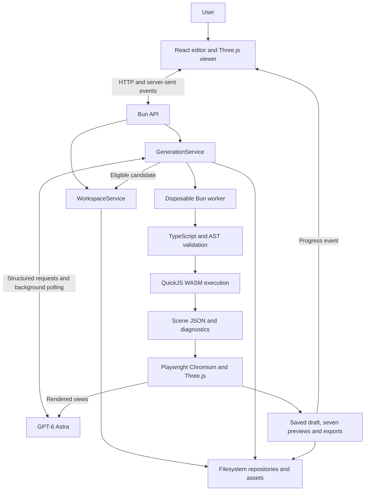
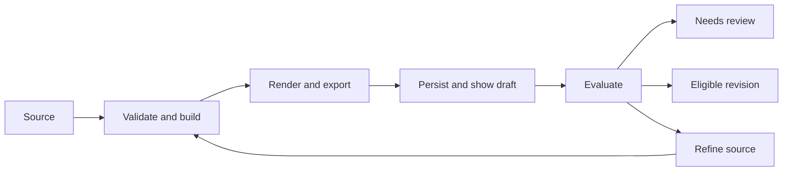

# Assemblavatar architecture guide

Assemblavatar is a local procedural 3D modelling studio. GPT-6 Astra produces TypeScript that builds geometry; the application validates and executes that program in isolation, renders its output, and asks Astra to evaluate and refine it. Users can inspect every rendered draft, edit source or object properties, and export models.

This guide describes the current implementation. The [full specification](../specs/assemblavatar.md) defines the intended product, [implementation state](../implementation-state.md) records delivery evidence and limitations, and [optimization phases](../specs/optimization-phases.md) proposes a future continuation workflow. Proposed capabilities are not implied to be implemented.

[Project README and setup](../README.md) · [Repository overview](../../README.md)

## 1. System overview

The application has three execution environments: the user's browser, the Bun server, and disposable workers used for generated code and rendering.

Generated code does not execute in the editor or in the server's JavaScript environment. QuickJS receives the trusted modelling runtime and the validated program. It returns scene data, which the trusted renderer and viewer interpret.

## 2. Source map and responsibilities

| Component | Responsibility |
| --- | --- |
| [index.ts](../index.ts) | Creates the application, recovers interrupted jobs, serves the frontend and API, and handles shutdown. |
| [backend/api.ts](../src/backend/api.ts) | Routes HTTP requests, validates input, checks local origins, handles uploads/exports and streams job events. |
| [WorkspaceService](../src/backend/services/WorkspaceService.ts) | Assemblage operations, draft persistence, revision commits, restoration, duplication and deletion. |
| [GenerationService](../src/backend/services/GenerationService.ts) | Coordinates source generation, repairs, builds, renders, evaluation, refinement and cancellation. |
| [AstraClient](../src/backend/ai/AstraClient.ts) | Constructs multimodal prompts, applies structured-output schemas, polls background responses and records request metrics. |
| [persistence/store.ts](../src/backend/persistence/store.ts) | JSON repositories, asset storage, identifiers, atomic file replacement and restart recovery. |
| [sandbox/](../src/backend/sandbox/) | Program validation, trusted runtime bundling, disposable worker supervision and QuickJS execution. |
| [modelling/runtime.ts](../src/backend/modelling/runtime.ts) | Trusted geometry, materials, deformation, CSG, object naming and scene-budget enforcement. |
| [render/](../src/backend/render/) | Headless Chromium rendering, image validation, GLB import and export verification. |
| [frontend/app.tsx](../src/frontend/app.tsx) | Workspace UI, AI instructions, reference uploads, Results, source editing, history and progress subscriptions. |
| [frontend/Viewer.ts](../src/frontend/Viewer.ts) | Interactive scene loading, orbit controls, selection, transform gizmos and object-property changes. |
| [shared/domain.ts](../src/shared/domain.ts) | Persistent records and build/evaluation types shared by client and server. |
| [shared/modelling-contract.ts](../src/shared/modelling-contract.ts) | Versioned API exposed to generated model programs and supplied to Astra and the compiler. |
| [shared/scene.ts](../src/shared/scene.ts) | Scene loading, override replay, camera framing and resource disposal. |

## 3. Authoritative state and derived artifacts

For procedural models, source code, parameters and manual overrides define the model. Scene JSON, screenshots and GLB/GLTF files are derived outputs.

| Record | Meaning |
| --- | --- |
| Assemblage | User-facing project, references and pointer to the current accepted revision. |
| SourceProgram | Versioned TypeScript source associated with a committed revision. |
| Revision | Source/artifact links, parameters, overrides, reference IDs, prompt, evaluation and provenance. |
| ModelArtifact | Scene JSON, GLB, GLTF, thumbnail and preview asset references; may belong to a draft or a revision. |
| GenerationJob | Current stage, status, pass count, latest draft pointer, evaluation and any processing error. |
| BuildAttempt | Generated source and diagnostics; a rendered attempt also retains its artifact, previews, settings and feedback. |
| ReferenceAsset | Photograph or texture reference with an asset ID, role and description. |
| Message / request metric | User-facing job conversation and provider operation/usage records. |

### Drafts and revisions are distinct

Every successfully rendered candidate is saved before evaluation. It appears in the viewport and Results even if it later receives major quality issues or a provider request fails.

A draft does not have to advance the assemblage's accepted revision. Currently, candidates without a `major` evaluation issue are eligible for a revision commit; the evaluator can still recommend further refinement. Revision existence therefore does not mean every quality objective has been satisfied.

`WorkspaceService.commit` writes the source, artifact metadata and revision before updating the assemblage's head pointer. Readers should not observe a head referencing an incomplete revision. When the artifact was already saved as a draft, the commit reuses it.

Results retains rendered attempts. History contains committed revisions. Restoring a revision changes the head pointer; the next committed build creates a new revision with a parent link rather than overwriting the restored revision.

## 4. Generation and refinement lifecycle

1. **Reserve the assemblage.** Reject another active operation on the same assemblage. A server instance allows at most two generation jobs at once.
2. **Save the job and instruction.** Persist progress state and the user's message before asynchronous work starts.
3. **Assemble context.** Load source/settings and references. Up to six photo references are chosen, with front-labelled images first; existing or newly generated previews provide visual context.
4. **Obtain source.** Generate a new program, refine existing accepted source, recover a saved attempt, or use explicitly submitted manual source.
5. **Validate and build.** Execute the source in the isolated pipeline. For AI jobs, send diagnostics back for a bounded number of repairs when validation or execution fails.
6. **Render and publish.** Render seven views, export geometry, persist the draft and broadcast `preview-ready` before asking for evaluation.
7. **Evaluate.** Compare rendered images with references and the instruction. Store the assessment on both the attempt and job.
8. **Commit or continue.** Commit an eligible result, stop for review, or request another refinement within the pass limit.

Manual builds use validation, isolation, rendering and revision persistence but do not make AI calls. The handwritten examples use this path.

### Current continuation semantics

The generate endpoint accepts `resumeAttemptId` for a stopped job in the same assemblage. It reuses the attempt's source, rebuilds and re-evaluates it. The first pass can therefore be preparation only; a one-pass recovery can finish without a source change. An evaluator request for user review can also stop automatic refinement.

The frontend supplies the displayed draft's parameters and overrides when continuing it. Other API callers must supply the intended settings explicitly; the recovery path does not automatically restore all draft context.

These behaviours, profile persistence, explicit photo selection and baseline-relative optimization are addressed by the proposed [optimization-phase specification](../specs/optimization-phases.md).

## 5. Generated-code boundary

The entry point is `buildModel(ctx)`, returning a root model object and optional metadata. Programs use `ctx.runtime`, metres, Y-up and radians; the model front faces +Z. The compiler also permits locally settling asynchronous builders, although Astra is prompted to produce synchronous ones.

Isolation is layered:

1. **AST checks:** Restrict imports, host globals, dynamic execution, unsupported syntax, nesting, literals and computed access. Reject compiler reference directives.
2. **Type checking:** Check source against the actual modelling contract using TypeScript's compiler API.
3. **QuickJS VM:** Run the transpiled program with no installed filesystem, network, environment or host-function bindings. Enforce VM memory, stack and execution limits.
4. **Scene validation:** Enforce geometry, object, triangle and bounds limits and serialize the resulting scene.
5. **Outer worker deadline:** Terminate the disposable Bun worker on cancellation, failure or timeout, including time spent validating before VM execution.

The trusted runtime supplies primitives, transformations, materials, CSG, lofts, extrusion, lathe, smoothing/subdivision and deformation. Stable object identities derive from names and hierarchy, allowing manual overrides to be reapplied. Renaming or restructuring generated objects can still affect identity continuity.

This is a local, single-user design. The TypeScript compiler and Chromium are host processes and do not share the QuickJS heap quota. The boundary should not be described as an independently audited multi-tenant execution service.

## 6. Rendering, editing and export

`RenderService` serializes operations through a queue and reuses a headless Chromium browser. Each operation gets a fresh browser context with external requests blocked and an operation deadline. Trusted browser code loads scene data and resolves textures through server-provided asset data URLs.

Rendering produces 768 × 768 PNGs for front, left-45°, left, right-45°, right, back and top. It uses fixed camera directions, consistent framing and studio lighting. These are review views, not camera-pose matches to the uploaded photographs.

The export pipeline creates GLB and embedded GLTF, then reloads the GLB and checks its geometry. Imported GLB files must contain their resources and may not require unsupported extensions. Import provides viewing and re-export; it does not reconstruct a procedural builder.

The interactive viewer loads the same scene representation and replays revision/draft overrides. Object edits change transforms, visibility, materials or grouping. Saving edits rebuilds from source plus overrides. Generating new source and manually transforming existing objects are separate operations.

Selecting an object for an AI instruction provides context; it does not enforce a lock on other geometry. Likewise, a request to preserve a feature is currently prompt guidance rather than a verified constraint.

## 7. Progress and user feedback

The UI receives job updates over server-sent events from `GET /api/jobs/:id/events`. Events include stage, pass count and the latest rendered attempt ID. On a new attempt, the frontend retrieves the saved scene and displays it while later AI work continues.

On refresh, assemblage details include the latest job and available drafts. The editor restores the displayed result and reconnects to an active job. The viewer remains usable for inspection while edits are disabled during active work.

Quality shortfalls finish as **Needs review**. Processing errors remain errors, but do not discard earlier rendered drafts. Cancellation also preserves completed results. The UI labels drafts, provides their feedback and supports draft export.

The optional [WebMCP adapter](../src/frontend/webmcp.ts) is feature-detected and exposes listing/opening assemblages. The normal interface works without it.

## 8. OpenAI integration

Only the server reads `OPENAI_API_KEY`. Public configuration reports whether a key is configured, never its value. The client submits instructions and asset references to the local server.

`AstraClient` sends the modelling contract, profile instructions, source/context and labelled images through structured Responses requests. Zod schemas validate generated programs and evaluations. The current client requests at most 12,000 output tokens and includes at most 13 images per request.

Long operations use background creation followed by status polling. The client records response identifiers and usage, retries retrieval within bounds, and attempts provider cancellation when local work is cancelled or fails while a response is pending. It does not silently resubmit generation on a failed retrieval.

Requests set `store: false`; background operation still entails temporary provider retention for polling. See the existing [API integration notes](../README.md#long-ai-requests-and-recovery) for the linked provider documentation.

Request metrics are operational records, not a phase-level spending controller. The proposed optimization workflow adds overall budgeting and stronger continuation records.

## 9. Persistence and local deployment

The default data root is `data/`, containing JSON repositories and binary assets. Assets use opaque generated IDs and metadata with ownership, MIME type, byte count and SHA-256 hash. Mutable records use temporary files followed by atomic rename.

This is not a database transaction across all files. The ordered head update provides a commit point for revisions, but an interrupted operation may leave unused assets. One server process should own a data directory.

Deleting a reference from the active list retains its asset for historical use. Deleting an assemblage removes its records and owned assets. There is no multi-user authorization or remote deployment authentication layer.

The API binds to loopback by default and checks Host, Origin and cross-site request metadata. Image uploads are signature-checked and decoded; source, upload and geometry budgets are enforced separately.

On startup, active jobs from a previous process are marked failed. Completed draft assets and accepted revisions remain stored, but execution does not resume automatically. Prefer `bun run start` for long jobs: backend changes under `bun run dev` can interrupt active work through hot reload.

`.env`, local data and generated build outputs are ignored by Git. Do not embed credentials in source, browser configuration or documentation.

## 10. Configuration and repository integration

The authoritative defaults and bounds are in [backend/config.ts](../src/backend/config.ts).

| Setting | Default | Purpose |
| --- | --- | --- |
| `ASSEMBLAVATAR_HOST` | `127.0.0.1` | Bind address. |
| `ASSEMBLAVATAR_PORT` | `3000` | Standalone app port. |
| `ASSEMBLAVATAR_DATA_DIR` | `./data` | Persistence root. |
| `OPENAI_MODEL` | `gpt-6-astra` | Enforced generative model. |
| `AI_REQUEST_TIMEOUT_MS` | `600000` | Deadline per AI operation. |
| `MAX_GENERATION_ITERATIONS` | `4` | Maximum passes offered per job. |
| `MAX_PROGRAM_REPAIR_ATTEMPTS` | `3` | Repair allowance per pass. |
| `SANDBOX_TIMEOUT_MS` | `10000` | VM execution budget; the outer worker adds validation allowance. |
| `SANDBOX_MEMORY_MB` | `128` | QuickJS heap budget. |
| `MAX_SOURCE_SIZE_KB` | `500` | Source length limit. |
| `MAX_OBJECT_COUNT` / `MAX_TRIANGLE_COUNT` | `1000` / `300000` | Scene complexity limits. |
| `MAX_UPLOAD_SIZE_MB` | `30` | Upload size limit. |

The repository launcher assigns Assemblavatar port **3009**, leaving port 3000 for the portal. It sets `ASSEMBLAVATAR_PORT` explicitly because this app uses a project-specific port variable rather than the other demos' `PORT` convention. The portal follows the existing plain-HTML card layout and serves its screenshot through an explicit asset allowlist.

See [run-all.sh](../../run-all.sh), [portal-server.ts](../../portal-server.ts) and the [portal page](../../index.html). Running the launcher also runs dependency installation and starts all demos; it is not a documentation preview command.

## 11. Verification map and extension points

Existing verification is organised by boundary:

- [Unit tests](../tests/unit/): storage, request lifecycle, validator and refresh/recovery records.
- [Modelling tests](../tests/modelling/): geometry, overrides and stable identities.
- [Integration tests](../tests/integration/): sandbox execution, generation orchestration and HTTP behaviour.
- [Render/browser tests](../tests/render/): deterministic PNGs, GLB round trips, editing/export workflows and live draft visibility.
- [Live scripts](../scripts/): paid provider benchmarks, with local reports rather than checked-in credentials or personal images.

See [README verification commands](../README.md#verify). This guide does not report a new test run or authorize live requests.

When extending the app:

- Add modelling operations to the shared contract and trusted runtime together; generated source must use the same API the validator checks.
- Keep draft persistence ahead of evaluation and avoid making visibility conditional on acceptance.
- Treat source/settings, artifact persistence and head promotion as separate steps.
- Preserve references and lineage when adding user-directed optimization phases.
- Keep provider access on the server and generated-code execution inside the isolated worker.
- Keep proposed reconstruction, camera fitting, anatomical parameters, verified locks and phase budgeting distinct from implemented behaviour.
