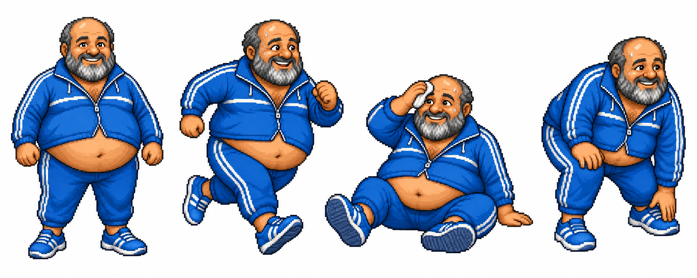
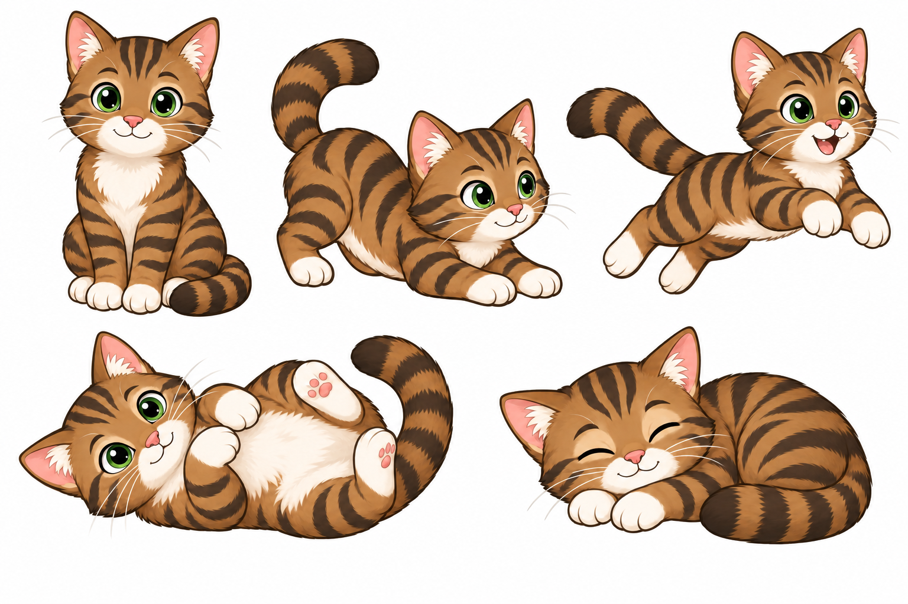

# Character pose studies

Static reference artwork for [specification §12.2](../not-a-virus-spec.md#122-character-references-and-art-direction), generated on 2026-09-18 with the built-in OpenAI image generation tool using the supplied JPEG references. Original references are unchanged. Exact generation and correction prompts are recorded in [prompts.json](prompts.json). The generated PNGs retain their content provenance metadata.

These white-background sheets are design references. They are not transparent atlases, sequential animation frames, or loadable packs, and are deliberately outside bundled `resources/packs/`. Runtime asset and release status remain in [IMPLEMENTATION_PLAN.md](../../IMPLEMENTATION_PLAN.md).

## Paco

Four full-body studies preserve the blue-and-white tracksuit, exposed belly, gray beard, rounded proportions, and warm expression. His running and getting-up poses show willing effort; seated recovery includes a small white cloth for wiping sweat. The pixel-art treatment stays distinct from gatita's smooth linework.

Visual review: faces and feet are fully visible, poses are separated, and identity is consistent. For animation authoring, keep the seated expression warm while making breathing/panting clearer, settle on a fixed pixel grid/palette, and establish a common ground anchor. The cloth is a pose-study detail, not an implemented runtime accessory. There are no turn/sleep studies or timing guarantees in this sheet.

## gatita

Five studies preserve green eyes, cream muzzle/chest/paws, pink ears/nose, brown tabby markings, and a rounded striped tail. The closed-eye rest suggests a contented purr without sound or symbols. Her bounding and rolling poses express playful movement.

Visual review: the first output introduced a dark gradient background; one targeted edit removed it. The selected sheet has a clean white background, distinct silhouettes, visible paws/ears/tails, and recognizable markings. Before animation authoring, lock stripe placement between views and simplify details for 128-point legibility. The static rest conveys the intended mood; it does not prove a visual purr animation.

Neither sheet has been approved as final runtime art or tested for frame-to-frame continuity, alpha edges, or anchor stability at the app's three sizes. Those checks require separately authored transparent animation frames.
